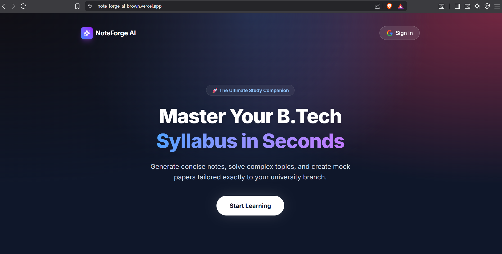

# 🎓 NoteForge AI

> **An Intelligent Full-Stack Study Companion for Engineering Students**



## 🚀 Overview
**NoteForge AI** is a comprehensive study assistant designed to solve the problem of generic study materials. It uses **Generative AI (Google Gemini)** to create syllabus-specific notes, mock examination papers, and interactive study modules tailored to B.Tech curriculums.

Built with performance and user experience in mind, it features real-time audio playback with word-level highlighting ("Reader Mode"), PDF exports, and visual progress tracking.

## ✨ Key Features
* **🤖 AI-Powered Content:** Generates detailed notes and strict academic-style question papers using the Gemini 1.5 Flash model.
* **🎙️ Smart Reader Mode:** Native text-to-speech engine with real-time "Karaoke-style" word highlighting for auditory learners.
* **📊 Progress Analytics:** Visualizes study progress per subject using dynamic charts (Recharts).
* **📝 Mock Exams:** Creates full-length, 70-mark mock papers with strict formatting (Part A/B) for exam practice.
* **💾 Smart Caching:** Implements MongoDB caching to reduce API costs and load times for previously generated modules.
* **🔐 Secure Auth:** Google OAuth integration via NextAuth.js for secure user sessions.
* **📄 PDF Export:** One-click download of notes and papers as clean, formatted PDFs.

## 🛠️ Tech Stack

**Frontend:**
*  **App Router**
* 
* 
* **Framer Motion** (Animations)

**Backend & Database:**
* 
*  **Mongoose**
* 
* **NextAuth.js** (Authentication)

**Deployment:**
* 

## ⚙️ Environment Variables

To run this project locally, you will need to add the following environment variables to your `.env.local` file:

```env
# Database
MONGODB_URI=your_mongodb_connection_string

# AI Provider
GEMINI_API_KEY=your_google_gemini_api_key

# Authentication (NextAuth / Auth.js)
NEXTAUTH_URL=http://localhost:3000
NEXTAUTH_SECRET=your_random_secret_string
AUTH_SECRET=your_random_secret_string

# Google OAuth
GOOGLE_CLIENT_ID=your_google_console_client_id
GOOGLE_CLIENT_SECRET=your_google_console_client_secret